# AWS Cloud Solution For 2 Company Websites Using A Reverse Proxy Technology

## Introduction

This project demonstrates how a secure infrastructure inside AWS VPC (Virtual Private Cloud) network is built for a particular company, which uses WordPress CMS for its main business website, and a Tooling Website for their DevOps team. As part of the company’s desire for improved security and performance, a decision has been made to use a reverse proxy technology from NGINX to achieve this. The infrastructure will look like following diagram:

## STEP 1: Setting Up a Sub-account And Creating A Hosted Zone

- Properly configure the AWS account and Organization Unit. Use this [video](https://www.youtube.com/watch?v=9PQYCc_20-Q&ab_channel=CloudAcademy) to implement the setup.
- Create an AWS Master account. (Also known as Root Account).
- Within the Root account, create a sub-account and name it DevOps. (A different email address is required to complete this).
- Within the Root account, create an AWS Organization Unit (OU). Name it Dev. (The Dev resources will be launched in there).

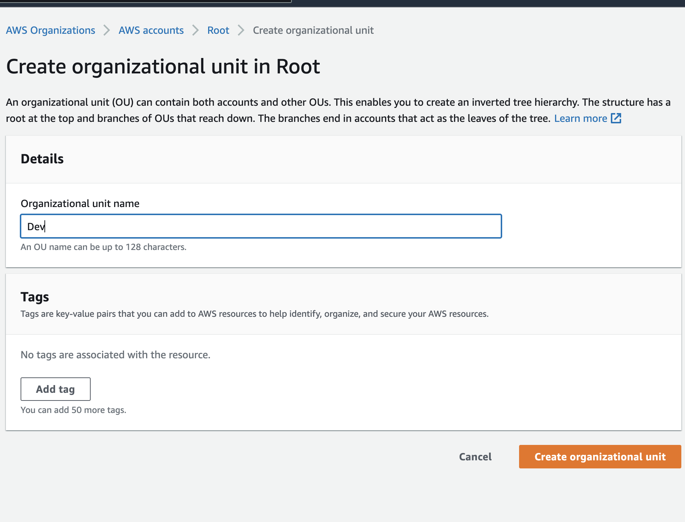

- Move the DevOps account into the Dev OU.

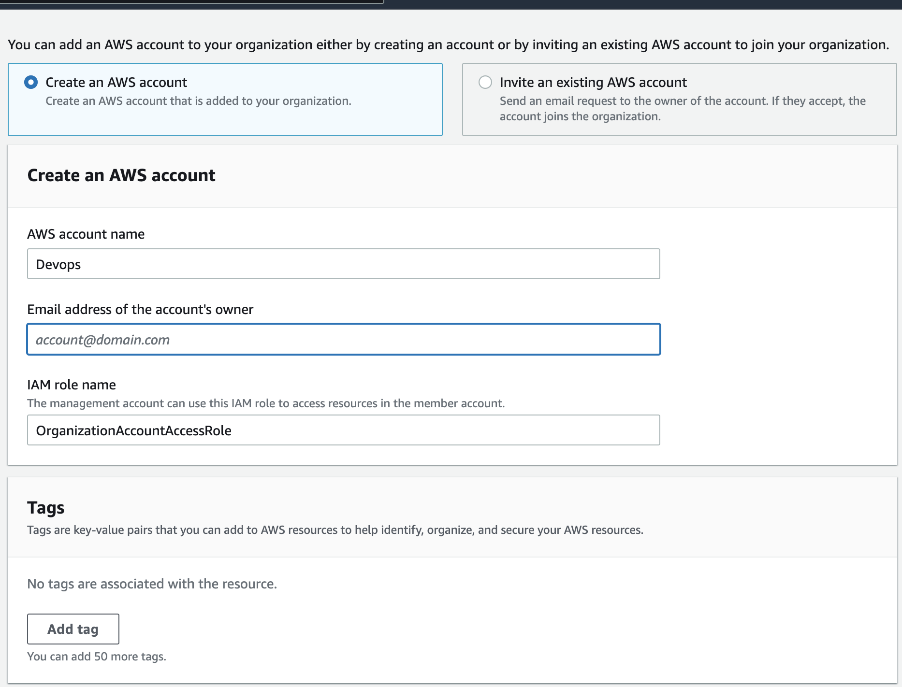

- Login to the newly created AWS account

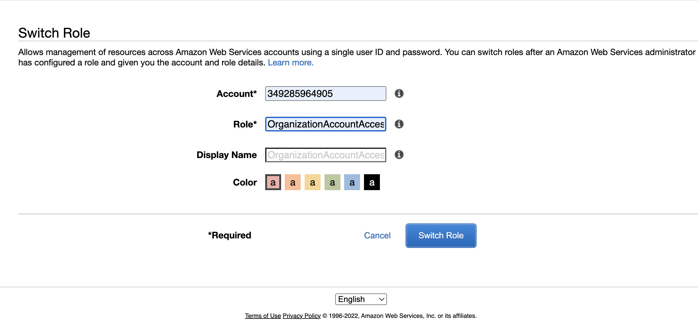

- Creating a hosted zone in the Route 53 console and mapping it to the domain name acquired from freenom.

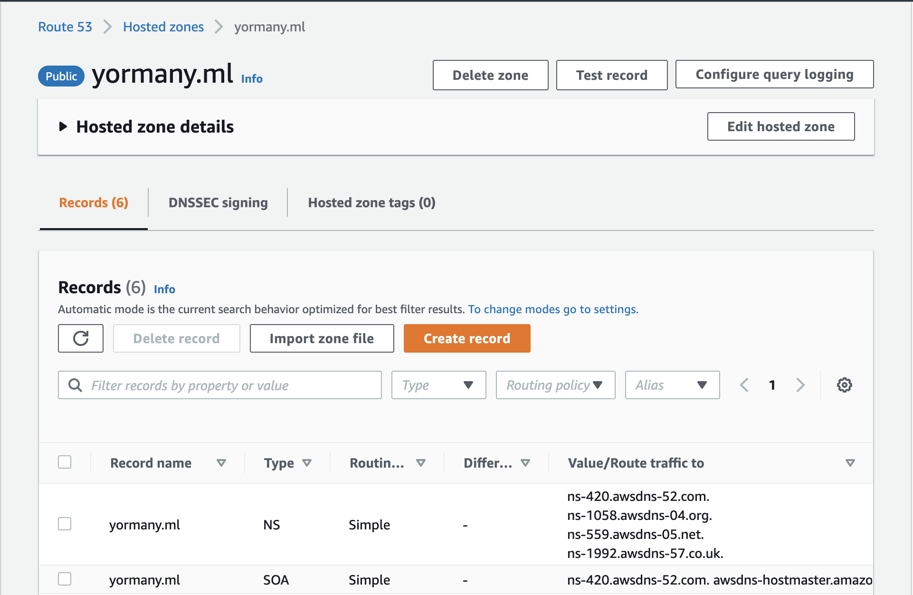

### TLS Certificates From Amazon Certificate Manager (ACM)

TLS certificates are required to handle secured connectivity to the Application Load Balancers (ALB).

- Navigate to AWS ACM
- Request a public wildcard certificate for the domain name previously registered
- Use DNS to validate the domain name
- Tag the resource

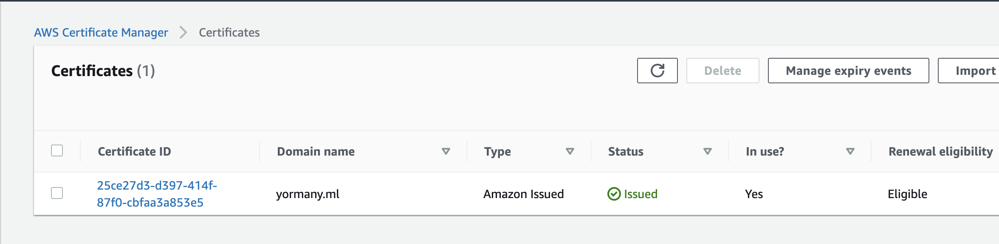

## STEP 2: Setting Up a Virtual Private Network (VPC)

1. Create a VPC and also enbale DNS Hostname resolution for the VPC.

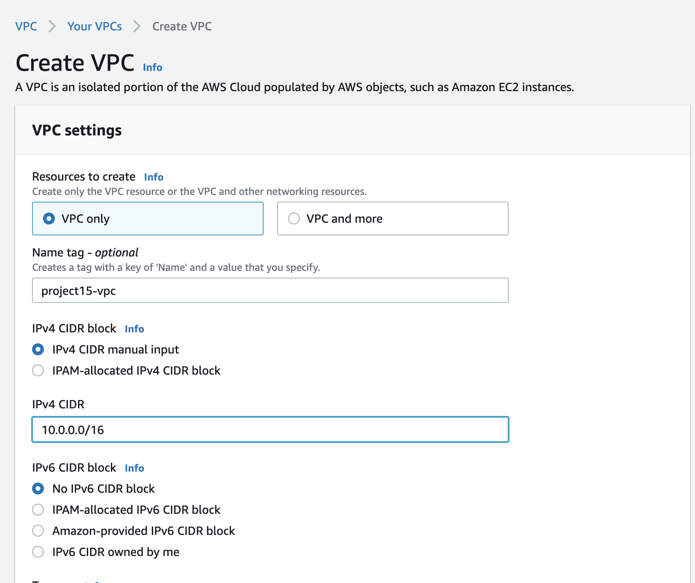

2. Create subnets as shown in the architecture.

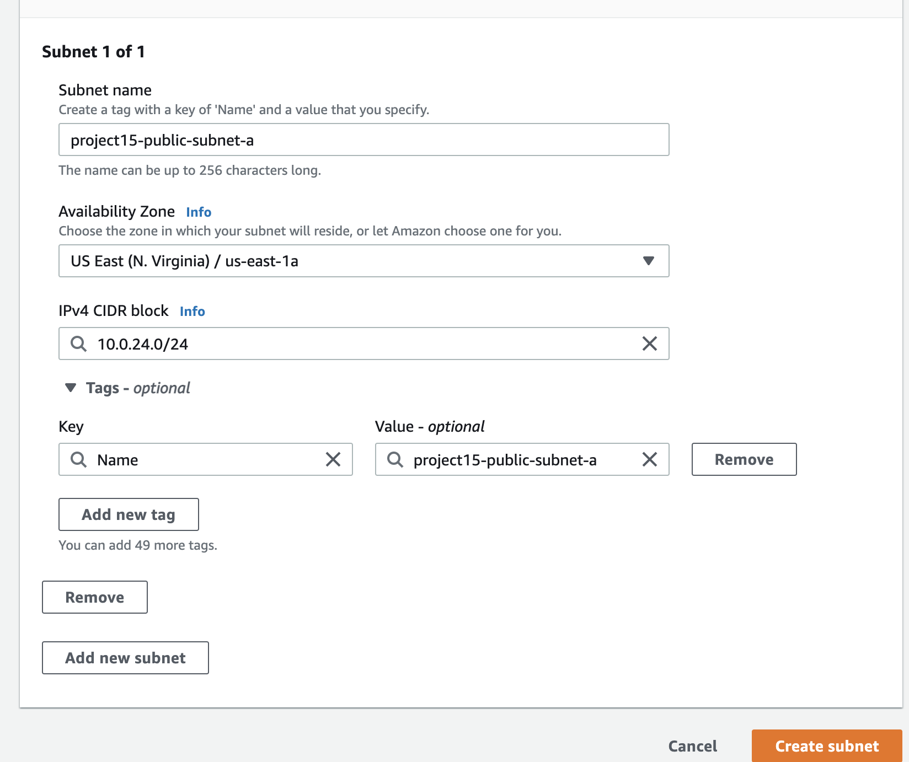

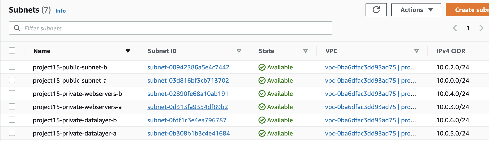

3. Create 2 route tables and associate each with public and private subnets accordingly. 

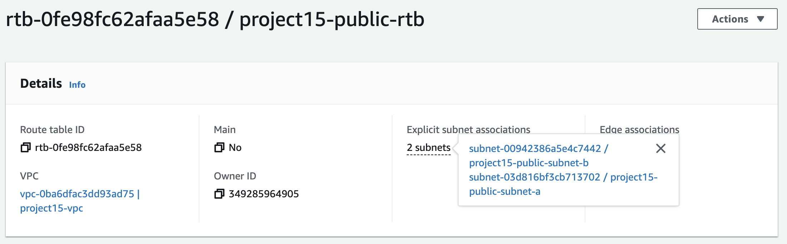

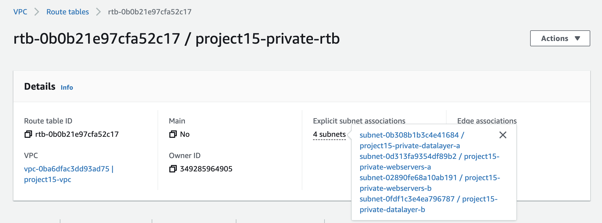

4. Create an Internet Gateway and attach it to the VPC.

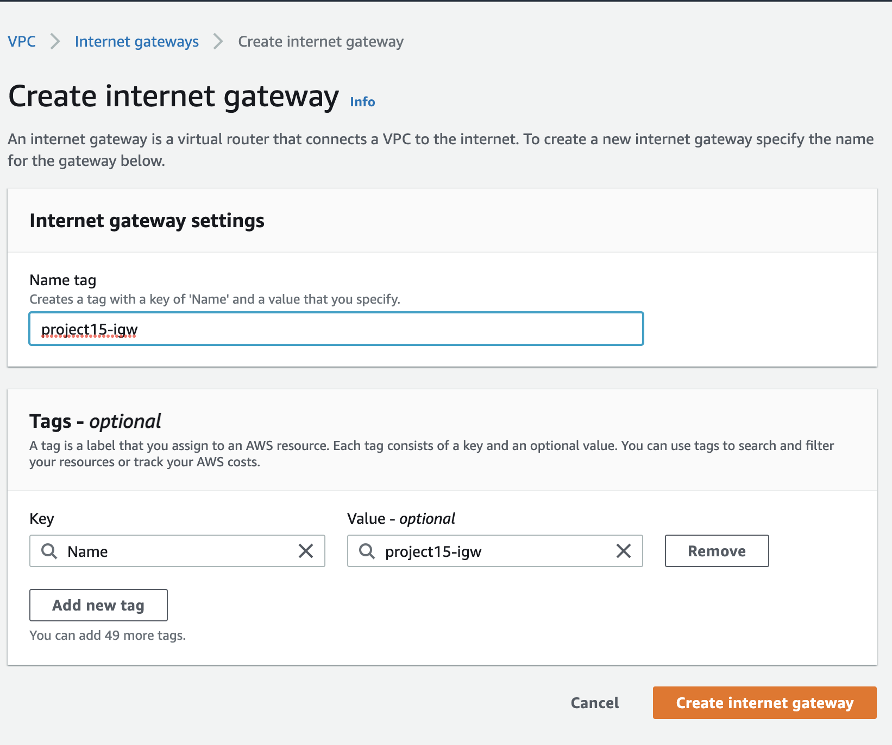

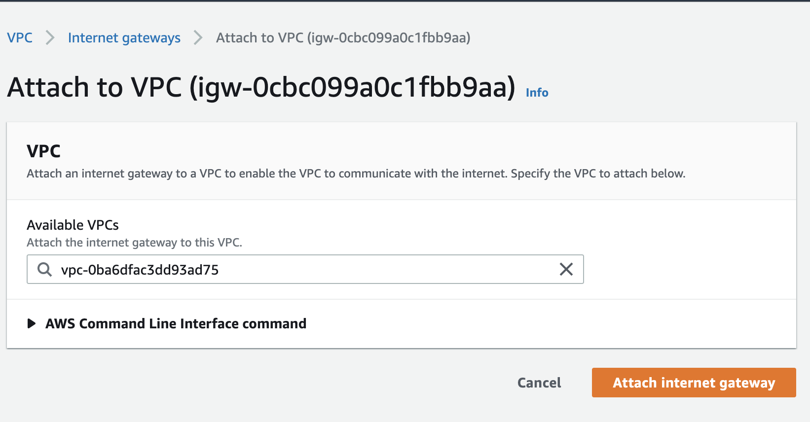

5. Edit a route in public route table, and associate it with the Internet Gateway. (This is what allows a public subnet to be accessible from the Internet). Specify 0.0.0.0/0 in the Destination box, and select the internet gateway ID in the Target list.

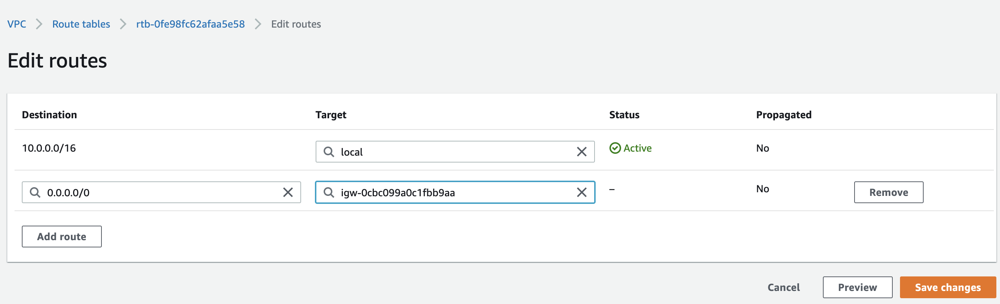

6. Create 3 Elastic IPs.

7. Create a Nat Gateway and assign one of the Elastic IPs (The other 2 will be used by Bastion hosts). Add a new route on the private route table to configure destination as 0.0.0.0/0 and target as NAT Gateway.

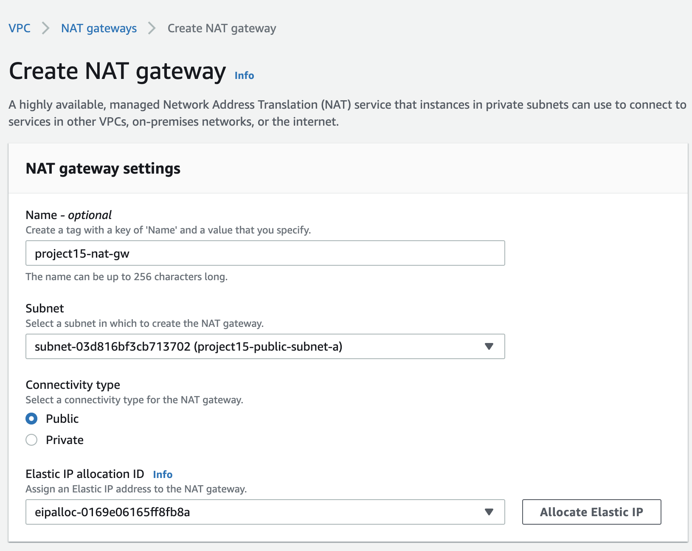

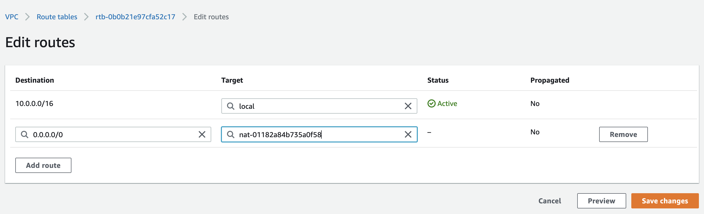

8. Create a Security Group for:

- Nginx Servers: Access to Nginx should only be allowed from a External Application Load balancer (ALB). At this point, a load balancer has not been created, therefore the rules will be updatedlater. For now, just create it and put some dummy records as a place holder.

- Bastion Servers: Access to the Bastion servers should be allowed only from workstations that need to SSH into the bastion servers. Hence, use the workstation public IP address. To get this information, simply go to terminal and type curl www.canhazip.com.

- External Application Load Balancer: The External ALB will be available from the Internet and also will allow SSH from the bastion host.

- Internal Application Load Balancer: This ALB will only allow HTTP and HTTPS traffic from the Nginx Reverse Proxy Servers.

- Webservers: The security group should allow SSH from bastion host, HTTP and HTTPS from the internal ALB only.

- Data Layer: Access to the Data layer, which is comprised of Amazon Relational Database Service (RDS) and Amazon Elastic File System (EFS) must be carefully designed - webservers need to mount the file system and connect to the RDS database, bastion host needs to have SQL access to the RDS to use the MYSQL client.

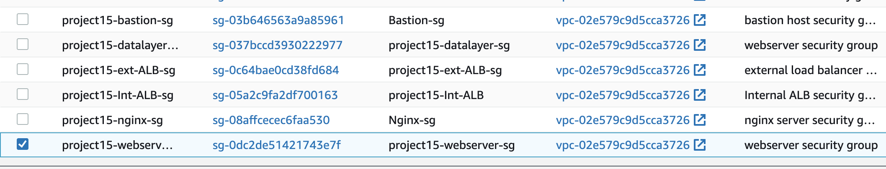

## STEP 3: Create EFS

1. Create an EFS filesystem.
2. Create an EFS mount target per AZ in the VPC, associate it with both subnets dedicated for data layer. Mount the EFS in both AZ in the same private subnets as the webservers (private-subnet-01 and private-subnet-02).
3. Associate the Security groups created earlier for data layer.
4. Create two separate EFS access points- one for wordpress and one for tooling. (Give it a name and leave all other settings as default). Set the POSIX user and Group ID to root(0) and permissions to 0755.

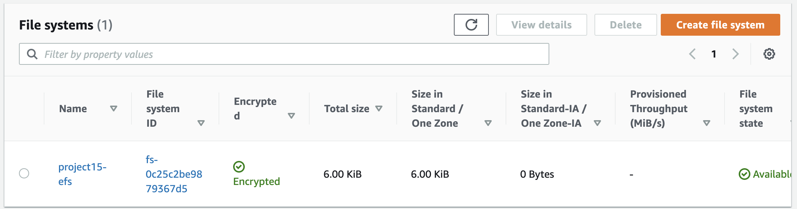

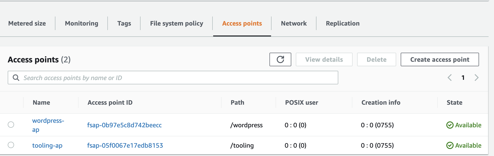

## STEP 4: Create RDS

Create a KMS key from Key Management Service (KMS) to be used to encrypt the database instance.

- On KMS Console, choose Symmetric and Click Next. Assign an Alias.

- Select user with admin privileges as the key administrator.

- Click Create Key.

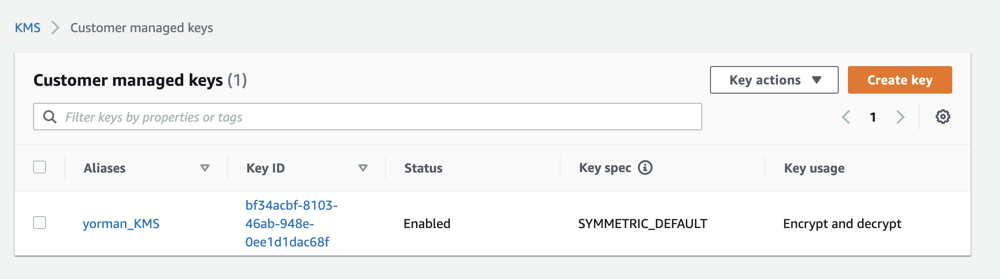

### Create DB Subnet Group

On the RDS Management Console, create a DB subnet group with the two datalayer private subnets in the two Availability Zones.

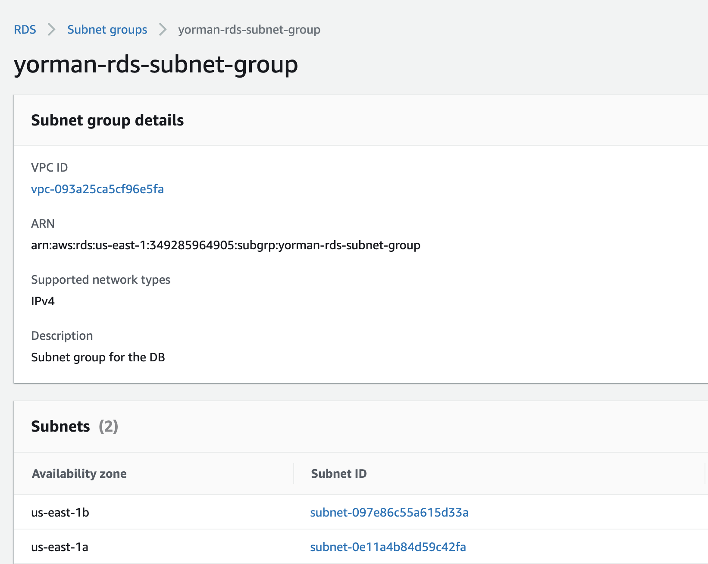